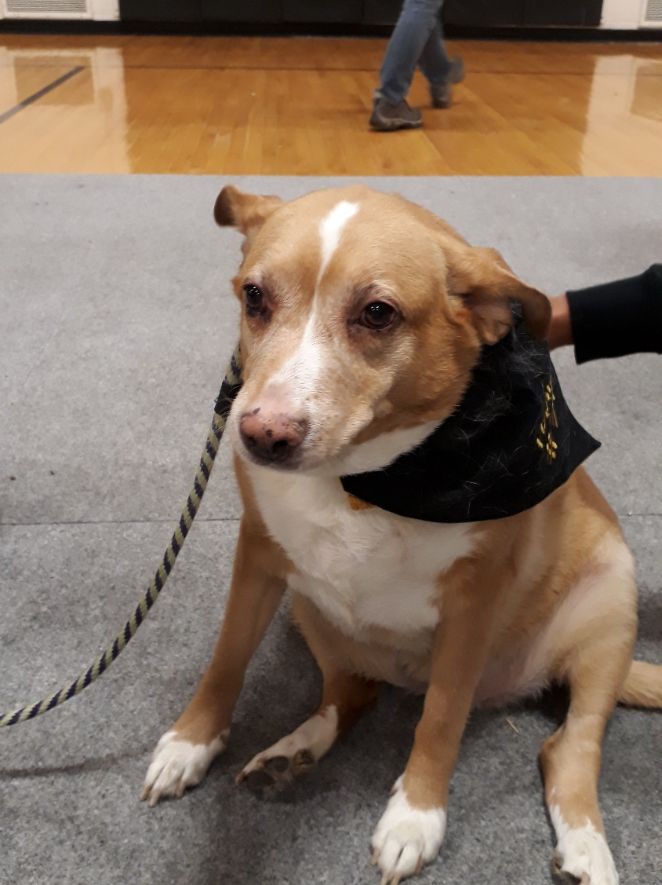
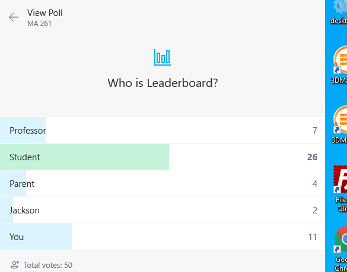
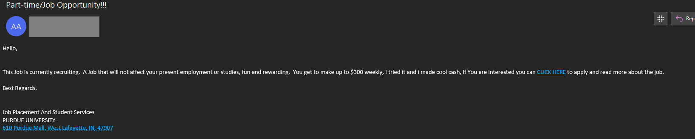

# Report 6 - Crossing oceans

*A short review of my year abroad at Purdue as an exchange student at St Andrews for the year 2019-2020.*

## Before we start

This is Leaderboard’s sixth report and one of the longest ones till date and tries to chronicle my Purdue experience for the academic year 2019-2020. Please note the following:
* This is meant to be unbiased. It is possible that readers of this report may feel that it is slightly biased against St Andrews, but this is coincidental. It is not feasible (with this report already long as it is) to cover every single thing at Purdue. Everything here is my own opinions and views otherwise stated.
* Identity policy: by design, I have tried to keep things as uncensored as possible. This can mean negative or positive parts of certain individuals being highlighted at parts of the report, and email communications put here. As with Report 2, I encourage **anyone** that has issues with their placement at any part of this report to contact me though any of the various mediums that I am in (one way is an email to dm282@st-andrews.ac.uk) and I will made appropriate modifications through version updates as required. The same applies if you think I have been unfair, rude to anyone or anything – I’d like to hear your feedback.
* This will be the first report to be dual-released in M and P flavours – M for GitHub’s Markdown as it is more responsive and native (especially for mobile users), while the P version has pagination and is the formatting as I wanted it to be from the start. The content is the same.
* The metric unit has been used as far as possible, as I hate imperial units. You may use your favourite search engine to convert wherever possible.
* Where module codes should be mentioned, they will be of the form (CS P/CS Q) or (MA P/MT Q), where P is the module code at Purdue, and Q is the module code at St Andrews. Note that P is almost always 3 digits at Purdue, and Q is always 4 digits. This is meant to help students from one university who may not be familiar with the equivalent elsewhere. Also please see https://www.cs.purdue.edu/academic-programs/courses/index.html for Purdue and https://www.st-andrews.ac.uk/coursecatalogue for St Andrews.
* Assets included here are the copyright of their respective owners (which could be myself if I created them).
* There is no guarantee that future cohorts will experience anything similar to what I had, especially due to the virus (see Part 5).
* **Markdown only**: Please hover over the images to see the caption (which is displayed directly in the **P** version). This also servers as the alternate text.

Finally, please enjoy this piece of work constructed over a few nights. I was supposed to write a report as part of my scholarship requirements, and this is meant to satisfy that as well.

Technical information:  
Version 1.0 RC1**M**  
Compiled on 4/6/20  

> **M** or **P**? It is up to you. The **M** version is easier to read on mobile or tablets, while the **P** version is PDF, has pagination and has the formatting that I intended from the start. The content is identical.

## Part 1 - Getting there
### Introduction

Going abroad was certainly not something I was ever thinking about as a high school student. I mean, isn’t 3 or 4 years short enough already? At that time, I was mainly aiming for universities in the United States, so the plans I had were substantially different. Maybe if I got into Cornell, I could have been at Oxford for a year? But study abroad was certainly nowhere on the list of priorities.

However, what I planned never happened. Instead, I got a perfect N/N rejection count for all universities in the US. At this point I thought that I would never be able to go to the US (not that it mattered a lot given the challenging situation I was at that time). Then St Andrews occurred, and realising that it had a decent study abroad programme, wondered (along with my parents, who encouraged me to seriously consider this option) whether I could instead have the both of both worlds by studying in the UK and US (not that I particularly wanted to go there, but as we’ll see I didn’t have much of a choice later). 

My situation was more complex than the average student – as a direct entry student I would not have any reference grades (CSA requires a strict 13.5/20+ in first year) for then when they would eventually decide on my study abroad application – and my parents had to specifically confirm, with the Maths department, that it was actually an option. This was further corroborated when I attended the Study Abroad invitation session where they said that I would be given an additional condition to fulfil instead.

Fast forward a month later – it was time for me to decide which universities to go for. Turns out that the University of California, which would have otherwise been a very solid choice, was now blocked for CS students at St Andrews due to students going there having serious issues when trying to register for classes, amongst others (when I spoke to the then CS study abroad coordinator). As a joint-honours student, I could only pick the universities that St Andrews allowed for both Computer Science and Mathematics, and this excluded universities that I would otherwise have picked – like University of Hong Kong for CS or National University of Singapore for Maths. This basically left me with the below:

I did not want to study at Canada (and University of Toronto was not an option) and University of Auckland did not appeal to me very much. This left me with Purdue and University of Virginia. I decided to take University of Virginia as my first choice simply because I knew someone studying there but kept Purdue as a strong second choice. Auckland was my third, though if I got that, I would probably not have taken it.

The next step was getting the reference, to which my CS2101 lecturer agreed (but was unsure on how strong I was, again due to the lack of reference points). Fast forward another month to November. I was done with my application but had to get two “permissions” (basically granting me permission to go ahead) with both my coordinators. The CS part was painless, but the Maths coordinator abruptly told me that I could not go ahead (this late?) as he thought that direct entry BSc students were not allowed to study abroad due to the lack of first-year grades. This was incorrect – I had rigorously checked the CSA website for any blockers – and it said that while direct entry MMath students can apply only for their third year (i.e, Senior Honours) and that Fast Track students are blocked entirely (this is due to them having to overload due to their unusual degree structure), nothing was mentioned for direct entry BSc students. This hence confused and shocked me. Fortunately, he reversed this the next morning, confirming that I was eligible to go ahead indeed! This was a real relief, as a refusal there would have been the end.

The next part was waiting for whether I would qualify for the second stage, which would be a formal interview. That did happen in late November 2018, with a date fixed for early December. And they strongly recommended wearing formals – god why? Don’t they know that I hate formals (like suits) with a passion? I hated it back then and hate it even more now. A pro tip – I don’t see how the dress someone wears should have any influence in your selection process </rant>.  Anyway, the interview was fine. The questions were standard for the most part, asking on why I decided to go for study abroad as a direct entrant, how I would cope with life there, and also how I could show my academic performance given the lack of first year (fortunately my coursework were fine). And in the end, they asked me whether I would be happy to go for Purdue considering that many people picked University of Virginia – to which I immediately agreed. Purdue was a strong second choice for me, and I knew it was still a pretty good place. Then they said that they’ll finalise the decisions either way within a few days. 

Few days? No, it was much faster. 24 hours. The next day when I was at Leuchars waiting for the train to Leeds for an on-site interview, I got an email. 

> Dear Darsh  
 Further to your recent interview for the St Andrews Abroad programme, I am delighted to offer you an exchange place at Purdue University in the academic year 2019-20.  This will be for the full academic year.  
>  Please read ALL of the information below carefully.   
Please note that this offer of a place is conditional upon the following:   
> 1. The successful completion of your modules this academic year and your progression to Honours;
>  2.	The successful completion of any additional academic conditions set by your School;
>  3.	Your attendance at the Study Abroad pre-departure briefing session in April (further details nearer the time);
>  4.	Your signature of a Pre-departure Agreement, confirming your acceptance of the University’s Study Abroad Terms & Conditions. Details of the Agreement will be provided in Semester Two, but you can read the Terms & Conditions under Study Abroad documents here: https://www.st-andrews.ac.uk/studyabroad/outgoingstudents/documentation ..

Okay, so that meant that
*	I got in to Purdue (which was fine and expected)
*	I wasn’t set any additional conditions (that is unusual, I was fully expecting to be asked to get 15 in the December 2018 diet as a condition, and I was told that they ask for one for direct entrants)
*	I must get into Honours, which would be easy enough

That was a real relief. I simply let my parents know about this and then went normally. After all, I had an interview the next day… Fortunately, they gave me a generous time window of over a month to make up my mind, and I accepted it after briefly discussing this with my parents a few days later. Purdue, here I come?

### Preparation

After this, I forgot about it for some time. The December 2018 exam diet came (and I did reasonably well for the most part), and soon I started my second semester at St Andrews. I mostly kept this a secret, telling that I would not be returning to St Andrews for JH slowly and in proportion (my own roommate was not informed until late). I had some procedures to follow from Purdue’s end, including formally applying as an exchange student and uploading relevant documents, but otherwise did not do much. 

Then came Purdue’s email inviting me to pick my module choices (and gave me 3 days’ time span). This was unexpected and while I had some ideas in mind, I did not yet know which track to take. Turns out that the choices I picked at the form would be completely different to the courses I eventually took. It should be noted that this does have a drawback, which I’ll explain later, and hence I advise students to plan as much as possible.

However, the email did come with an unexpected warning – not to pick more than 3 CS/Math (that is STEM) courses per semester as it would be otherwise overwhelming. This was confusing and concerning, and I did not know what to do. Turns out that this is illogical for St Andrews students (particularly Joint-Honours students) – while a single-honours student can easily do by with 3 CS and 2 non-STEM courses, a joint-honours student needs at least 4 (2 CS and 2 Maths in my case) – as otherwise there will be a shortfall! And there are actually courses from both categories I want to take! In the end, I opted for a 1:3 split in CS:Maths, with the intention to make it up in the second semester. Though if there are non-STEM courses that I wanted to take, I would not have hesitated to pick that, just that the core courses I wanted to take were many.

And change they did. Firstly, one of my original choices was MA450H (~ St Andrews’ MT3505+MT4003). But MT2505 changed my mind about group theory. Secondly, I did not know whether to take a “broadner” course like computer graphics (CS334/CS4102) or dive deep into operating systems (CS354/CS3104). I picked the former in the end. I explain this further at a later stage of this report.

Details about my accommodation will also be explained later.

Close to the end of the second semester, I applied for, and got the Santander Study Abroad scholarship of 2000 pounds. While not a lot in comparison to my room/board fees itself, it still managed to offset costs like getting the visas and even essentially paid for a round-trip. Thanks to St Andrews for providing me with this scholarship as it indeed was useful.

### Prepatory sessions

I had to attend a few sessions as part of getting ready for study abroad. One of which was common to all – that outlined the general procedure that applied to everyone (including those going for a work placement instead). The other (optional) session was more tailored to those going to North America – and featured talks from former Study Abroad students, and my Maths advisor was also present (who is pretty experienced with US universities having studied and taught there). That was also the point where I got my black Purdue welcome booklet which contained my DS-2019 and other Purdue-relevant information.

### The J1 visa

As a non-US citizen planning to study at the US, I needed to get a J1 US visa. The process involved for this involved first going to London for the visa interview (why make people from Scotland suffer so much?). This was a roller-coaster. I reached London only to realise that I booked the visa interview one day early. Fortunately, I was able to immediately reschedule this for the next day, but this blunder also meant that I needed a place to stay for the day – to which my CS classmate Tallal Mirza came to my rescue and allowed me to stay with him (thank you so much!). The queue for the actual day was long (+ they would allow a Surface Pro tablet, but not my ThinkPad convertible), but once all that was done, my visa was approved, and I would get my passport… in a few days and I had to go to a obscure location in Edinburgh for that (usually I would rather do that than have it delivered, but in this case I should have asked for delivery). Though I got my visa at the end!

### Coming to Purdue

So I reached the US two weeks before with my parents because none of us had ever visited the US and wanted to experience it (though I personally disagreed, but well). We got down at New York and roamed there for some time, then went to D.C by car, roamed there, went back to New York for the Niagara Falls, roamed there, and then went to Indiana. All with the same car (a Ford Flex). Despite the huge distance, this was doable because both my parents drive, and hence all they had to do was to get IDL (international driving licences) and then share the driving load. And with the huge luggage, flying was anyway prohibitively costly thanks to United and Co’s crappy baggage policies. I wished I could help as well but did not have a licence.

Once we got into West Lafayette (which is where Purdue is at!), my parents dropped me off and said goodbye. That’s where I also met my roommate (it should be noted that Purdue allows you to pick your ‘mate, though such an option was useless for me). His name was Logan Flake.

And I also brought the textbooks for my classes. One of them was physical, one online (which I could not escape as that was required to do the homework). A detailed description will follow.

## Part 2 - General life

*While some unavoidable academic discussion might happen here, I’ll defer the core of that to a dedicated part.*

### The first days

This was difficult. Firstly, Purdue does not have a “formal” orientation week like St Andrews does (i.e, there is no Week 0). Note that while Purdue has BGR (Boiler Gold Rush) that appears to be a paid “Week 0”, one had to pay $320 for it, and its purpose was not clear to me back then. I should note that opinions on BGR were generally positive and many reported that they got many friends that way. Anyway, going back, this meant that I had a difficult first week or so as I knew basically no one. And as Purdue was quite new for me, I relied on Google Maps to find my way around and get to my lectures.

The rude surprise was the existence of an unknown fear on doing anything. This was surprisingly severe, and I was quite puzzled on what was going on with me – I did not face anything like this when I started at St Andrews. I was scared to do anything, felt very emotionally tensed and it took a lot of support by my parents to pass that horrid few days. It was severe enough that I even ate substantially less at that time. Partially because I knew no-one and hence struggled to get those first few friends. 

That being said, Purdue did have a couple of events for study-abroad students that I popped in. They were useful as expected and a nice way to know other exchange students. Though the number of UK exchange students were quite few, and I seemed to be the only one coming from St Andrews. Also many students were for a semester, which I wasn’t (and St Andrews CS blocks single semester exchanges).

However, after that initial challenges, things started to get substantially better.

### Clubs

Purdue has a lot of clubs that vary to different interests, more than St Andrews as one would expect simply given Purdue’s sheer size. Being the type of person that is mostly interested in academically oriented clubs, I was naturally drawn to those that are part of CS and Maths (similar to what I did at St Andrews). And that is what I did. A brief description on some of what I went for is shown below:
* CTF (capture the flag) – very good. They gave bootcamps on the foundations of CTF, including tools like reverse engineering, hacking and so on. They even had a bootcamp CTF that I liked very much as well. I did not pursue beyond that, though they regularly take part in CTFs and other events. 
* Math Club – Purdue’s variant of St Andrews’ SUMS. Decent; they had weekly events and some socialisation was possible there (and the president was my classmate in complex analysis). But they did not host major events and ignored my event proposal. I could not attend any of them in the second semester as it directly clashed with one of my classes. Though one of my professors came to host a talk with the club – and played a tuba instead…
* Purdue Hackers – direct equivalent of St Andrews’ STACS. Wasn’t that involved though took part at BoilerMake, which is again St Andrews’ analogy of STACSHack. More than 4 times bigger. I did very poorly, and while this experience has made me reconsider taking part in future hackathons, I should note that it is not BoilerMake’s fault at all – on the contrary they did a good job. It was my problem of handling teamwork that was the problem instead, and this remains a serious bug of mine.

* CPU – competitive programming union. Decent – they hosted monthly events (including prizes, though I never got one but was very close to getting it). However, this club had the most impact in what I did in the end. One of my St Andrews friends Kanishk Ali Khanna was not happy at the lack of a similar club at St Andrews (and STACS wasn’t doing much in the field of competitive programming). To this I naturally thought about filling the void, and there came out a new club Competitive Programming St Andrews (abbreviated as CPSTA). Initially it was hidden as a small Messenger group with a few other like-minded students discussing LeetCode contests and the like. At the beginning of the second semester we thought that it was the right time to start expanding, and out came the weekly coding contests, which as of writing is still going on.
  
  This should not be underestimated – it was the direct influence of a club (and hence my study abroad experience) that inspired me to start a similar society here. I was never expecting this to happen. Part of this was Purdue being good in competitive programming in general, but it was the presence of CPU that made me wonder why there weren’t anything similar at St Andrews – and fix that.
  
There are a few others, but nothing to mention as I was there only on a “trial/test” basis.

### Sports/Recreational centre

The direct equivalent of St Andrews’ Sports Center is Purdue’s France A. Córdova Recreational Sports Center, and this is something where Purdue beats St Andrews hands down. For a start, it is much bigger:

And while I never used the Sports Centre at St Andrews, I did go there a couple of times (mainly when taking the final exams), and Purdue’s simply bigger, has more facilities, and is, well, better at virtually all aspects. This is with respect to indoors; I don’t think Purdue has a golf court, though they definitely have a football stadium (Ross-Ade). Football at Purdue is a big thing; Logan had a season ticket and he used to go for every home football match. I, well, just couldn’t be bothered, though most of you should consider going for at least one. (My apologies to all those that really wanted me to go for one)

Also, it’s free for students, unlike at St Andrews where one has to pay more than 150 pounds a year (a reason why I never bothered to go myself). They take the fee from all students’ tuition – and while that is not only reasonable (roughly $40 a year) - I don’t pay it at all (exchange students pay the tuition fee of the host that is St Andrews in my case). This was a major motivator for me to go there, as I could always go whenever I wanted without having to pay for something that I may never end up using. And use I did. Not frequently, but I did exercise a bit on the days I did go there and made an effort to do so where possible. They also have wide opening hours (close on 12 AM, not sure how that compares to St Andrews).

### The weather

Generally reasonable. In the hotter months, it would go up to 20-25 C, which is reasonably cool. As winter approached, it naturally reduced, from around 10 – 15 C from late October to the first instance of snow:

")

Though it started getting cold after that, but even during the Semester 1 finals it was not that bad, around -8 C at most. This would be cold at St Andrews.

I was told that it truly gets bad in Semester 2, and that was true. When I returned back it was already pretty cold (– 10 C), and it hovered around [-5, -20] C from there, and was rarely positive. The right screenshot shows a screenshot from my phone when it was (-18 C) – at those temperatures, a full jacket **is** essential!

It also snowed far more frequently than at St Andrews (which happened exactly twice when I was there), and it was not unusual for my jacket or bag to get wet as well.

Many tell that the temperature in the Midwest (like Indiana) is not to their liking, and this unpredictable and cold weather is the reason. But it is not that awful either, at least considering that it was once (-38 F/-39 C) and classes were still on (not when I was there though)! When it was (-18 C), one of my lecturers cancelled her class for the day, but others went as usual.

### GroupMe and Leaderboard

It refers to the social messaging platform of the same name owned by Microsoft and is de facto the messaging tool used by Purdue students to talk to each other. It is definitely possible to survive without Facebook. 

Notice the username – Leaderboard. For those who know me, that should hardly be a surprise – after all, Leaderboard (or its derivatives) is the name I use at 99% of online sites. However, this is not the case at Purdue at all, and this led to some confusion to who Leaderboard was (after all, that’s me). 

![Figure 10 What happened after I let out my GitHub link. There was a repository with St Andrews stuff (at that time the Purdue repo did not yet exist) so these people somehow concluded that I was some sort of a traitor. Scared and confused, I pressed the emergency stop switch and quickly left the chat, silently changing my GitHub to reflect the fact that I had some role at Purdue. I was pretty disappointed at all this considering that I had given a lot of clues that I was truly and well in the class. At least one (Liam Robinson) apologised to me in person later though.](assets/R6P10.png "Figure 10 What happened after I let out my GitHub link. There was a repository with St Andrews stuff (at that time the Purdue repo did not yet exist) so these people somehow concluded that I was some sort of a traitor. Scared and confused, I pressed the emergency stop switch and quickly left the chat, silently changing my GitHub to reflect the fact that I had some role at Purdue. I was pretty disappointed at all this considering that I had given a lot of clues that I was truly and well in the class. At least one (Liam Robinson) apologised to me in person later though.")

(Text for Figure 10: *What happened after I let out my GitHub link. There was a repository with St Andrews stuff (at that time the Purdue repo did not yet exist) so these people somehow concluded that I was some sort of a traitor. Scared and confused, I pressed the emergency stop switch and quickly left the chat, silently changing my GitHub to reflect the fact that I had some role at Purdue. I was pretty disappointed at all this considering that I had given a lot of clues that I was truly and well in the class. At least one (Liam Robinson) apologised to me in person later though.*)

I got to know a lot of these people virtually though this way, and that is sad because I never met them in real life! In the above screenshot, I saw only one in person, and that was by a chain from someone else who I knew a bit earlier. I think part of the difficulty was my relative rigour in maintaining a sense of anonymity though the Leaderboard pseudonym, which while entirely in line with what I usually did, was not something most did. And though my real identity can be easily found though some digging from my GitHub, no one bothered to do so (obviously other than to troll me that first time). 

Would I have gained more friends and got to know others better if I was a bit more open? I do not know. But my general shyness with getting friends was a detriment.

### The MA261 database

This was a simple venture that I started to provide basic resources for students taking that class (which I was also at that time). I started by providing homework solutions (after the deadline!) so that students could also use it to prepare for their quizzes, and as expected, not a lot used it at first (there would be that initial spike before it cooled down). However, I proceeded by providing written solutions to past papers and also statistical analysis to the exam scores (which many used to predict their finals). 

And I got a good number of views – there were times where > 700 views were there to the database in a day (usually the day before an exam, and in such weeks I could have more than 1000 views)! No other GitHub repository of mine had ever been anywhere that popular with one exception. Yet I felt that the resource was underappreciated at times. This was mainly due to someone else beating me – Liam Robinson again. What he did was shock everyone and publish *videos* of past exam papers (instead of my written method). To be fair his resource was *excellent*, and while I had no use for them, a majority found it very useful to the extent that his YouTube channel has > 450 subscribers and one of his videos easily racked up > 2000 views. Adding to the fact that others knew him better then they knew me (after all, who am I?) and that YouTube is more well-known than GitHub, and his resource system ended up being significantly more popular than mine in the end. I wished I could say that he was inspired from me (because I started my MA261 database before he started his YouTube), but he denied this.

This should not distract from the fact that overall this attempt can be construed as a success, and was an interesting example of using my St Andrews ideas (where I made the Module Database before St Andrews got wind of it and stopped publishing module averages) into a Purdue context, with a different set of benefits. Yes, there were times that I felt underappreciated and that I was a bit annoyed about Liam’s popularity. Though I was able to easily restrain myself because one of my core philosophies is that *I like to help*. I do not care about the end result – if I have helped one person, then I am satisfied. And let’s be fair – Liam worked quite hard to make his resources – much more than what I made for mine. 

### Parties, corruption and Greek

Unlike St Andrews, Purdue has a reasonably active Greek life/sorority, but their benefit was unclear at best and I have heard a host of negative things about them (from them serving underage alcohol to others). There was no benefit to joining one after checking with some others, and hence I did not engage with Greek life at all.

And as for drinking, it is significantly less prevalent from my experience. Part of my perception could be from the fact that most of my Purdue friends did not drink, but it is harder to get ethanol in general. There is only one official place where any form of alcohol can be obtained, and even then, it is just beer (harder forms can be obtained at Crave, but that’s pushing the line). Sure, unofficial bars do give alcohol, and sororities is another way. That is, if you want to drink, it is possible, but it’s not like the union itself is an ethanol-setting machine like at St Andrews… Also I am told that indoor smoking is not allowed, this was a major fear of me before coming to the US.

And it should be noted that the legal drinking age at Indiana is 21 years, so it was off-limits to me anyway. Though it is possible to catch underage students drunk – in fact, that’s the *only* time I ever encountered drunk students at Purdue! I was returning to my room one night after working on some homework problems, and I could smell a distinct smell of alcohol, with some random boys and girls randomly chatting around. I quickly confronted the group, who were very quick to admit that they were drinking, and some of them underage as expected. The storyline goes like this: they were at a frat party, but the police shut down the party as it was too loud, and they were sitting here for two hours… Anyway, it was interesting having a chat with them and they were friendly with me. Though the police argument is believable – they did come to the building a few times to check for drugs and alcohol (which is not allowed at any Purdue residence).

Also, Purdue handles smokers better. Unlike at St Andrews, such people have only 20 designated places where they can smoke, and while there are a few who flout them, the rules are followed for the most part. St Andrews needs to urgently block smokers from killing everyone wherever they like (yes, I don’t have much respect to those who do, especially near the door entrances and the union, seriously?).

### IT and computing facilities

Like St Andrews, Purdue also uses Active Directory and I could login to most computer (except department-restricted) using my Purdue credentials. However, Purdue generally manages its computers better than St Andrews. For instance,
* Purdue uses Cisco’s GoRemote to access remote applications using my system, which is better than St Andrews’ AppsAnywhere (which felt like phoning itself every afternoon on my laptop).
* All computers at Purdue include Adobe applications. I am not sure why St Andrews has to restrict this to a small subset of its computers. And Purdue’s user permissions aren’t as bad either – St Andrews uses Windows AppLocker that blocks any executable other than a select whitelist; while highly secure, makes its computers look like a literal jail.
* (For CS) Windows computers use Deep Freeze. The benefit is that that provides full administrator access to all accounts. This is awesome as it allows me to run any testing application (like 3DMark) safely – Deep Freeze resets the computer upon logoff. I’ve seen students spend their Friday nights playing Apex Legends on the RTX 2080Ti machines (but why do those computers have only a Haswell Xeon?). St Andrews CS only provides standard user rights but that is understandable as they do not use Deep Freeze. A drawback is that all computers run with only one OS – either Linux or Windows, and the Linux systems do not use Deep Freeze and hence do not provide sudo either.

I mainly used my laptop – connected using an HDMI cable to the lab computer’s monitor. One of the labs had 4K displays, though I couldn’t use my laptop with them without downgrading to 30Hz (as my laptop only had HDMI 1.4). During the first semester, I often worked in the Math department’s labs – soulless, quiet and also had facilities where I could plug my laptop to get dual-screen. There are other such nice areas like the Mechanical Engineering’s labs which are equipped with Quad-HD displays (though I discovered this very late).

One irritating drawback is the spam filtering system. For some reason, Purdue does not employ Outlook’s default system and instead uses Cisco. The main problem is that it holds suspicious emails and then sends emails informing about them. I’d much rather have them sent to my Junk Emails folder instead! And there are often *cool cash* emails like the below:

What happens there is that students’ emails get compromised, and then spam emails like the above get sent to others. I first got one of them before even stepping foot into the U.S, and was naturally wondering who would contact *me* about a job offer… 

And they make people use a 2FA system known as BoilerKey (St Andrews makes it optional). This is irritating because that means that I have to take my phone every time I wanted to access a Purdue resource (there is a less-known trick to escape it for Blackboard/MMS, but they are changing the system to one where this does not work). I found this quite irritating, and what’s more, they don’t affect Office 365, and hence these spam emails still happen! St Andrews does this the right way…

### Getting around

Purdue has full free bus service around Purdue (it's the equivalent of Stagecoach providing free service around St Andrews and nearby), which is a very popular way of getting around the campus, though I personally preferred to walk. It's free even if I wanted to get into downtown Lafayette, which was very useful for the couple of times I needed to go there. St Andrews should definitely have a similar service - the nightly bus service was useful though its use was limited due to the limited time it was active, doing something similar daytime would be very nice.

## Part 3 - Room and board

### Application

Once I was formally accepted into Purdue as an exchange student, I had to apply for the residences and also choose a meal plan. Like the situation for incoming students at St Andrews, I could not apply for any one residence – rather, I had to apply based on the type (so one option would be double with AC). Unlike St Andrews, there is a higher focus at double rooms, and while getting a single is still certainly possible, it is costlier and not something I wanted, having had a good experience with Raiyan Chowdury when I was at St Andrews. So, my first choice was easy – double without AC. And why without AC? It was clear that these residences were older, and I was certain that they’d handle heating well as they still had to do that in 1960… And it wouldn’t be that hot, plus I wasn’t planning to stay at my room other than to sleep. 

I had to also pick my meal plan. Unlike St Andrews, they are not only *mandatory* for 95% of students unless they happen to be living at one of the residences where this is not mandatory, but they also cost substantially more on the surface. On the surface though, as some calculation shows that this isn’t that bad. The upside is that there is some flexibility on the meal plan irrespective of where you stay (this isn’t the case with St Andrews where meal plans are tied in). And it gets better.

### The residence

In the end, I was allocated to Tarkington, one of the oldest residences that was build sometimes in the late 1950s, and without air-conditioning. I knew my roommate beforehand: as said in Part 1, his name was Logan Flake (*cornflake* as I put it, though he said that other flake derivatives like *snowflake* were names he was previously called by). Confusingly, an internet search found that he was a Creative Writing major (non-existent at St Andrews), which made me a bit confused as he was also in the Honours College (note that “Honours” at Purdue has a completely different meaning to that at St Andrews, while it is *de facto* in the latter, not many do it at the former with its extra requirements). I certainly was not expecting creative writers to roam around there. 

Turns out that was completely true, and he fired the first shot:

> What's up, I'm Logan and I'll be your roommate this year! I just wanted to send a quick email introducing myself and to ask you a few questions regarding our room. In terms of appliances, do you plan on bringing anything like a fridge, microwave, etc.? If not, I think I could for sure bring a fridge for the room that both of us could use. Maybe a microwave too, but I'm not as sure about that. Just let me know!

Notice that he said about bringing a fridge and microwave. This might confuse St Andrews students, as while bringing such items is not allowed there, it’s completely normal at Purdue (and I’ve seen far more elaborate furniture modifications!). I was also confused, and it took a follow up for him to clear that for me.

The first port of call at Purdue residences is the RA (Residence Assistant), who is normally an undergraduate, and in this case, was a second year CS student from Indiana. He was reasonably good, organising a reasonable spread of events and weekly dinners (that not many showed up, and neither of us did either).

Now for the residence itself. The room is mostly fine. While St Andrews’ DRA is slightly bigger, DRA is substantially costlier than Tarkington (room-only).  Only in the summer months was it anywhere warm (and that is about 20 – 25 C), and Logan had a fan ready for that. The heating did its job well in the winter.

And key access was a bit irritating – I needed to use my PUID (ID card) to access the main building, but my physical key to access the room. I think tying the room key to the PUID is better? And even accessing from within the building requires the use of the PUID, surely I should not have to carry *both* my key and my PUID to get out of my room? And losing the key would mean a fine of $50.

However, there was one drawback – the bathrooms. I don’t know if that’s the case in St Andrews’ older residences (like McIntosh/John Burnet Hall?), but it was weird. Showers are shared in an approx. 10:1 ratio, and to make matters worse, the water temperature was very inconsistent. You have a hot and cold faucet, and the most likely probability was that either the water was freezing cold or boiling hot. Getting the right temperature was ridiculously hard, and this was a complaint that others also seemed to have. There were also times where the water pressure was way too low or again inconsistent. Newer residences at Purdue seem to have a better shared bathroom design, and certainly St Andrews’ Fife Park (where I lived over the summer) did better in that respect, with a meaningful 2 bathroom:5 students design.

Another crappy flaw was that the lifts are 60 years old and are key-restricted to staff members only. Not acceptable when you consider that the building has 4 floors – and while I was at the ground floor, those at the top floors had to climb three floors of stairs… This also means that the building is *fully* inaccessible for wheelchair users, which is again not acceptable even though the building is old (a Purdue staff member admitted that they had faced at least two lawsuits before on the subject of lack of accessibility, though not necessarily on this building).

The residence also had common areas, where one could sit, chat and were also decent study areas to use. Laundry was handled in the ground floor and was cheaper than St Andrews and could be paid using BoilerExpress (can be thought of as a Purdue-only debit card inside the PUID). 

Overall, perfectly reasonable for the price (about $300 dollars per month, far cheaper than St Andrews!). As long as you ignore the meal plans, that is.

### Dining

This is another aspect where Purdue does well. One of the differences is that unlike St Andrews, Purdue meal plans are decoupled from the room, which means that one pays the meal plans in addition to room. And the meal plans aren’t cheap either:

This does mean that they try to inherently discourage from picking the lower meal plans because the base cost isn’t that much, and especially would rather have you take the unlimited plans (even then most people I knew comfortably lived off the 13-meal track). However, in my case, I opted for the unlimited plan simply because I eat meals three times a day. 

Where Purdue’s dining starts to shine compared to St Andrews is the immense flexibility and freedom available there. For starters, we don’t eat at our halls (like at St Andrews, wherein DRA students eat only at DRA). Rather, there are five dedicated “dining courts” where one can come and eat. This is not tied into any particular residence – I can go into Wiley for a breakfast and then go to Earhart for lunch. That is hugely advantageous. This meant that I could go to the residence that was for example, closest to where I was right now, rather than having to go to the one nearest to Tarkington. Furthermore, especially in the weekends, some dining courts have differing hours, and that similarly gave me flexibility to have a late lunch.

The opening hours are also much better than at St Andrews. Personally, I was not happy with St Andrews’ restrictive dinner times; 5 to 7 PM forced me to eat dinner much earlier than I was used to. Breakfast and lunch times also had a narrow time gap. Compare this with Purdue, where most dining courts are open till 9 PM, and 8 PM on weekends. In fact, some dining courts don’t close at all; they are open from as early as 7 AM till 9 PM! The only exception being Sunday where the dining courts are closed for dinner, but could I really complain on that?

And the food selection is also simply better. For one, I disliked the weird food policy at DRA (when I was there at least), as the main courses were rationed (the server serves you one out of three/four options available), and worse, you could take only one serving at all (that tripped me the first time)! I felt that would tempt some to take more than what they could and waste, and this forced me to precisely calculate beforehand how much food I wanted. Purdue’s dining courts operate purely on a buffet basis – you take what you want and there is no limit on the number of servings, just like how it should have been. And the selection itself is also considerably better. There is simply a greater selection of food all across the board, and some dining courts are “specialised” in some fields, plus there is an online app which shows the menu available at each dining court (hence many go to a dining court based on the online menu). Plus, this:

Indeed, made to order! The above picture was taken at Wiley and they offer customised scrambled eggs (or omelettes) for breakfast and the toppings were completely customisable, with options from meats to mushrooms and vegetables. Then they’ll cook it for you, and it’ll be ready in anywhere from 5 to 25 minutes depending on load. It was not unusual for there to be a queue, and hence I mainly used this in the weekends when I don’t have the time pressure to go for a class (though could easily have done it at the weekdays if I woke up early enough). Just picture this – custom made orders. 

And for lunch and dinner? Custom-made pasta, with a good selection of vegetables and meats to match. They even had gluten-free pasta! Very nice.

This is one thing that the dining courts use to specialise. Windsor offers custom made rice-bowls/tortillas, Earhart has its stir-fry and pizza, and other courts have others to match.

Overall, I think it would be nice for St Andrews to emulate the core of Purdue’s model. Of course, it is illogical to expect St Andrews’ dining system to match that of Purdue, simply due to how much smaller St Andrews is, and also because Purdue does charge somewhat more. But I think St Andrews would benefit from a bit of centralisation where possible (for example. Andrew Melville, ABH and Whitehorn could combine together to create a large dining court) and perhaps reduce the otherwise awkward timing and serving rules. 

### PDQ, Dining Dollars and in-campus restaurants

Purdue has many in-campus restaurants, with many being based in PMU (Purdue Memorial Union). If you want to eat from there, there were three main options:
* Pay by cash/credit card/BoilerExpress – the traditional way
* Use Dining Dollars – this was a certain number of credits that can be used in all in-campus restaurants and was virtually equal to cash. Mine had $125 of credit, so I easily managed by using it for Sunday dinner and still had a substantial amount of credit left. Though it is very easy to use it up if you want it to. Dining Dollars could also be used at in-campus markets.
* PDQs – they are 8 additional meals (for unlimited; they replace meals otherwise) that can be used at many in-campus restaurants in lieu of the other two. However, this option does have drawbacks – PDQs can only be used at certain times (mostly dinner) and I personally found the portions to be on the smaller side. I mainly used this when studying at the library and when I would rather not go to a dining court just to have dinner. I also occasionally used this at the Aspire set of restaurants – good food but the portions under PDQs being quite small.

PDQs also have an additional use that I made frequent use of. They can also be swapped for quick meals near the dining courts, and I mainly used it only to get free snacks (that aren’t bad but get easily repetitive as they never change the flavours or the brands). The end result was my room desk being filled with snacks (but my brother ate them up very quickly in the end). Note that they used to offer a bit more in the years before I came, but I still say that 3 sides + a drink is pretty good for what is essentially just free snacks for me.

## Part 4 - Academics

Please note that I’ve used Reddit to share my overall experience of taking the courses at each semester. Links are available below:

* Semester 1: https://www.reddit.com/r/Purdue/comments/ectf0u/a_short_review_on_my_fall_2019_modules/
* Semester 2: https://www.reddit.com/r/Purdue/comments/givpib/short_review_on_my_spring_2020_courses/

### Choosing the modules

So, I was supposed to pick 15 credits of courses for each semester, though could optionally reduce the combined total by 3 (so the minimum I needed to take was 27). As said earlier, the advisor discouraged me from taking more than 3 STEM courses, but as a JH student I needed to take at least 4 anyway…

Selection of modules is done through Purdue’s confusing Unitime system, and consists of inputting a PIN provided by the advisor that is often time-limited (so I could choose my modules within a initial timeframe, and then make changes once registration was “open” for all). 

Anyway, so what did I pick at the end? For semester 1:

* MA261 (Multivariate Calculus) – St Andrews’ MT2503 and MT2506 combination. I planned to take something like this beforehand, because I was on the pure track and felt that taking an applied module would be very helpful for me. This would be impossible to do at St Andrews as it requires taking two modules and also because MT2506 always clashes with CS2002 for some reason…
* MA425 (Complex Analysis) – MT3503 equivalent. I still need to take courses that I would otherwise be taking at St Andrews, and this is one. Purdue’s pre-requisites are St Andrews’ MT2501/MT3504, though that’s nonsense, as MT2501 is definitely NOT enough.
* MA460 (Geometry) – an odd one. This one had no real pre-requisites, but St Andrews had no Euclidean geometry courses and hence this was an interesting one that I swapped for CS381. The former was not there in the second semester; the latter one was.
* CS334 (Computer Graphics) – took it to broaden my computer knowledge as a otherwise systems-oriented person. Looking back, this was a bad choice. Purdue’s pre-requisites were CS240 and MA265 (St Andrews’ CS2002 and MT2501, though MT1002 would also be enough).

While each course page does list the pre-requisites for that course, I’ve provided St Andrews equivalents as much as possible. Though some of them are nonsense. For example, as mentioned above, Purdue lists MA265 as a pre-requisite, that is simply MT2501. It is nonsense to take MA425 with only that, as we did some DiffEQ and the last part was full of challenging Mobius transformations. The pre-requisites in other places are given as MA262/MA266 (MT3504) and MA362 (MT2506), and those are more accurate from my experience. This inconsistency was a problem for someone not familiar with Purdue at that time, and note that the normal sanity checks done by the advisors are ignored for study abroad students, and hence I did was essentially taking a course without the pre-requisites, which I felt did affect my grade negatively.

For semester 2:

* CS354 (Operating Systems) – a critical course for me in many respects – the interesting course delivery using XINU (as others to St Andrews’ Linux version), and important for the 4000-level courses I plan to take at St Andrews.     There was a significant pre-requisite problem – Purdue has an official pre-requisite of CS252 (Systems Programming). While CS2002 does cover it, it is not to the same rigour. For example, CS252 covers implementation of malloc, something that is deferred to OS (CS3104) in St Andrews. They also cover C/C++ web servers, amongst others, and this is regarded as the hardest sub-300 level course in Purdue CS. Naturally, I was concerned, and so was my professor, who suggested that I take an additional course so that I can drop CS354 if it ends up being overwhelming. And I did not drop CS354 – the content hooked me, and it ended up being one of the best courses I ever took in the end even though that was challenging.
*	CS381 (Introduction to Analysis of Algorithms) – another important course and a well-taught one in that. I planned to take that as a replacement for CS3052 (which focused more on theoretical CS and had little discussion on algorithms itself, while in CS381 we did dynamic programming, graph algorithms and so on). Another very good course. Note that MT2504 would be a crucial pre-requisite for this course (Purdue CS students must take a variant of it, CS182. This is optional at St Andrews).
*	CS348 (Information Systems) – Purdue’s direct equivalent of CS3101 (Databases). A useful broadener course on databases, though not as interesting as CS381 and CS354. 
*	CS390 (Competitive Programming 2) – an interesting course focusing on solving various algorithmic problems in topics such as backtracking, dynamic programming and graphs. Very useful – significantly improved my understanding of data structures and algorithms and helped to an extent in CS381, plus this was not something that St Andrews had any equivalent in. 
*	MA366 (Ordinary Differential Equations) – as Purdue likes applied maths, I figured I would take this instead of MT3504 at St Andrews. But this is not a very good equivalent, as a lot of the material was MT2507-based and the lack of PDEs make this a bad perquisite for St Andrews modules that require it (unless MA303 is taken as well). There is also a lab component, which pushed this to 4 credit hours.

I would have taken CS352 (Compilers; close to CS4201) instead of CS348, but CS354, CS352 and CS381 are widely regarded as the three hardest Purdue CS courses and many told me that CS354+CS381 is difficult enough, which deterred me from taking CS352 as well. This was not a bad choice in the end, though I should have taken CS352 instead of CS334 in the first semester.
CS2001/2101 and CS2002 would satisfy most of the pre-requisites for Purdue, except that algorithmic courses will require MT2504. Purdue students take more maths pre-requisites than St Andrews – they essentially taken MT2501 (MA265/MA351), [MT2503, MT2506] (MA261), MT2504 (CS182) and MT2508 (STAT 350), and hence they can get a minor with just one more course (typically an analysis course like MT2502 (MA341)) while you can do with MT1002-level knowledge at St Andrews and nothing else! This is partially the reason some tell me that CS3302 and sometimes CS3052 get challenging due to their proof-based nature, and I personally think that MT2504 should be made mandatory for all students, especially those who can otherwise take it in first year for those not doing direct entry.

It should be noted that being at Purdue means that I am not subject to many of the usual course requirements that exist at St Andrews, especially for CS. Normally I would have to do CS3050 (Logic and Reasoning), CS3099 (the 30-credit team project) and CS3052. I know many of the concepts of CS3050, and would rather take more courses than do a team project. Going to Purdue allowed me to do this, and this must **not** be underestimated. This is the only reason I can take all of CS4201, CS4202 and CS4204 next year at St Andrews (due to OS being a pre-requisite); by taking OS, algorithms, and fitting in **two** more taught courses in databases and graphics. I never thought of such an idea when applying for study abroad, but this ended up being a **huge** advantage in the end. Especially as a joint-honours student, this can't just be overstated. Even for Maths, I killed two birds with one stone by taking MA261. This would again be impossible otherwise. (Sure, you can make arguments to learning online, but that is not the point here)

### Workload and assessment delivery

Assessments were generally more frequent and intense (but usually shorter). For instead, while for MT2501 I would have assessed work only every two weeks, for MA261 I would have online homework twice every week – and they took an average of two hours to complete. Though in general the coursework load for a module is higher at Purdue than at St Andrews – partially due to the latter’s methodology of not giving many assessed problems but still enough to practice for the finals. That is, while at Purdue every piece of homework is assessed, that is not the case at St Andrews at all. In an equivalent CS module, CS354 had five (reduced from 6) labs, compared with CS3104's two but longer practicals. That being said, the later labs of CS354 can still be difficult to complete, and only two weeks is given to finish each one, and hence it wasn't unusual for me to feel a "time crunch".

How about the workload? Undoubtedly more than second year at St Andrews (even with direct entry). Does that mean that Purdue is harder than St Andrews? This is harder to prove because third year (CS in particular) is known to be challenging, at least from my classmates back there. 

Purdue does provide more help per module for CS though. For 300-level courses, 3 out of my 4 courses had PSO (problem solving observations), which is close to lab demonstrations provided for sub-honours modules at St Andrews. Many of these courses have dedicated office hours provided by the TAs where questions can also be asked there, which is another benefit (it’s mostly a professor-only thing for an honours module at St Andrews). I have heard that 100 and 200-level courses (for instance the core pre-requisite CS180/CS1002) get a lot of support from labs to help sessions and more. 

### Undergraduates as TAs/lecturers

When I first got into Purdue and got into the Lawson labs, I saw a lot of help sessions offered for core courses like CS180 (CS1002) and CS240 (CS2002). Yes, Purdue is big, but surely, they cannot have that many PhD students, can they? Turns out that those are undergraduates helping undergraduates! They grade homework, conduct and grade labs, and in some cases even <u><i>lecture</i></u> a full class!

An undergrad being TA is totally not uncommon and I am aware of many that have TAs at least one. They are paid per hour, and while not high, reasonable and a job I would love to have. I wish St Andrews would allow something like this (Maths Base is something but does not count) and am so jealous of all those that have such an opportunity! Also, some students work in other departments, for instance grading homework for < 300 courses or being a lab instructor (my DiffEQ lab instructor was a second-year student).

Could someone like me get it? Unfeasible, though one can always try. It is hard partially because of the lack of Purdue courses taken in my situation, and because it is competitive – more in the spring than in the fall (still competitive) due to students graduating then. When I was turned down for the Maths side, I was told that the pass rate was 20%. The CS side did not bother supplying any information and I was silently thrown out for all the courses that I tried to TA for. 

I don’t expect such a change to come to St Andrews mainly due to the rigorous bureaucracy involved (that in itself isn’t a bad thing). However, I cannot see why some changes can’t be done. For instance, perhaps undergrads can work for first- or second-year labs in CS, can’t they? And the PhDs could perhaps work on some of the more popular honours-level courses (like CS3050, CS3052 or CS3101) depending on experience. They aren’t doing any grading, and if they help a student beyond a limit, that can be taken as academic misconduct. Honestly, I don’t see much of a problem with students grading coursework as well within limits considering that moderation is performed before the grades are released, though I can understand the resistance some will have for it.

### Grading scales and bureaucracy

Purdue has 12 pass grades from A+ (19 – 20 at St Andrews) to D- (7), but it is really up to the professor to decide what grades they want to assign and how. So some classes stick to a letter-only grading system (A, B, C, D and F), and others may keep the A+ cutoff very high. For a Purdue student the latter does not matter because A and A+ map to the same thing, that is, a 4.0/4.0. However, they don’t know about St Andrews students coming, and hence it is up to me to provide the documentation so that St Andrews can make appropriate adjustments to their grading scales. 

And in general, Purdue is less bureaucratic than St Andrews. Final exams are graded with extremely rapid speed – one of my exams that I took late night was graded by the next afternoon. And the final grades are given within a few days after the exams are done! Compare this to St Andrews where it takes up to a month for that…

But this has drawbacks. At St Andrews, if an exam is hard, it is most likely that you goofed it up, as exams are rigorously checked beforehand. For example, in Computer Science, exams are first checked by a member of the department, then sent to an external examiner (with answers!), and only then are they printed. This is true for other departments as well. This is impossible, and not done at all, at Purdue. Hence if an exam is hard there, it is very much possible that the exam was actually difficult. Case in point: my CS381 (CS3052) final had an average of 56%. The MA261 (MT2503+06) final mean was 57%. 

That being said, Purdue’s default “curves” of 90% for an A/17 to 60% for a D/7 is illogical and none of my modules had such a brutal curve, though it does happen that the cutoff for an A is still pretty high (MA261 was 85%, but for a D was about 38%). This is because of the higher proportion of high-scoring coursework compared to St Andrews (where the final counts more). The simple advice is – do as well as possible.

## Part 5 - The pandemic

I never planned to write this part, but the coronavirus, well changed everything.

### The initial days

As it is now well known, the coronavirus started in December 2019 and rapidly spread first in Wuhan, then to the rest of China, and now to the rest of the world. Till mid to late February, not many cared as the virus was mostly a China thing till then. However, from there the world started to take notice, and it started with my MSP Americas Summit in Mexico (remember Report 1 where I went to Amsterdam? https://github.com/Leader-board/Reports/blob/master/MSP%20Summit%202019%20report.pdf) being cancelled. Not just that, but many other tech events. However, many still had not woken up to reality partially thanks to that trumpet who is the U.S President. Purdue itself did not do much for a long time either, still saying as late as March 3 that it would be very unlikely for the virus to progress to a stage where classes would have to go online (St Andrews in comparison correctly predicted that classes may never be in-person for the rest of the semester). It *felt* however that something big would happen. In fact, my CS381 professor was spot on – it was the last class before spring break – he had already cancelled that Thursday (due to the midterm) – and he said something on the lines of “today is perhaps the last day you’ll ever see me in person”. That was a nice class. But that evening, something happened that would throw everything off gear.

### The sudden halt

That evening, we got this:

The CS381’s prophecy was true – we would not have any more in-person classes for the rest of the semester. But other than that, there were more questions than answers. How serious was this? Clearly it was serious enough for an entire university to close. But in the same email, they mention the possibility of the university restarting by April 6, which is confusing. Further questions pop up – should I leave? What is the probability I will be able to reach Bahrain safely? 

The poor professors were also at a loss. My DiffEQ professor admitted that he had never seen such a situation in his 20 years of teaching, and he also said that when the department met to discuss ideas and procedures for after the break, there were more questions than answers. Other professors also shared a similar view of uncertainty.

The next few days were filled with intense discussions with my parents on the situation and whether to stay or leave. There were significant reasons to stay – it was unclear whether I would be able to safely reach Bahrain with borders rapidly shutting down around the world, and Purdue Residences were repeatedly saying that it is absolutely safe to stay. On the other side, both I and my parents were totally unconvinced that the US was handling the situation properly – even at this time, Purdue’s health centre was incapable of testing for the virus! They were also pretty slow to react, and everyone now knows of the gibberish coming out from the president. My CS390 professor wrote a series of open letters on this subject, and his mathematical predictions were reasonably accurate: https://www.cs.purdue.edu/homes/ninghui/. In particular, he was the first professor to strongly recommend social distancing.

The initial decision was *not* to leave, and hence I started to prepare in case things get worse and we are all asked to self-quarantine. This is where my surplus of Dining Dollars came handy – I used part of it to buy essential supplies, and carefully used my remaining PDQ swipes for this as well. I also supplemented with a trip to Walmart, and while not critical yet, it was already clear that some were panic buying. Pasta and some other such items were limited, but for the most part I could still get what I was looking for, albeit with some substitutions. 

The next night, my parents called me up to take stock of the situation – and it was clear that the probability of the campus reopening for the rest of the semester was tending to zero, even as Purdue themselves were denying the probability that would happen. The ISS (that handles matters of international students like myself) also advised against leaving, saying that we would be blocked from re-entering. While this is probably true for many students (especially those going to work under CPT, or even going to graduate school immediately), I was not going to get an internship there anytime soon (hence AT would not apply). On the St Andrews side, the Study Abroad office was pretty slow to start with, which was annoying. However, the CS study abroad advisor (Dr Mark-Jan Nederhof) was as usual, very proactive and quick to respond to my concerns, and he pestered the office when I told him that I could leave soon. Initially they also advised against pulling the trigger. But that night, we made a snap decision. I was to leave Purdue immediately. I had 8 hours to prepare, and it was late night already. I was not sure whether they did the right thing (personally a 50:50) but I trusted their instincts, and, in any case, the US was playing around. 

This was difficult. I had to pack everything in my two small luggage with no advance warning, and also had food that I could possibly not carry. Still I think I could carry around 91% of my stuff in my bag, casualties being my pillow, some carboard and food (some of which would start leaking under the immense stress I placed all the components there). Fortunately, bus services to Purdue were still aplenty (this would not be the case a couple of days later). I notified Logan, had my dinner, cleaned my room, and had a short nap. The next morning, I had a quick breakfast, gave my key to the reception, and left Purdue. I remember thinking the previous night that it was a bit sad to have such a cruel ending to my Purdue career, and still think that it was cruel…

O’Hare was quieter than usual, but not as quiet as one would expect. In fact, the arrivals were choked or so as I heard as the US was quickly closing borders to EU residents (and soon after the UK), but departures not so much. It should be noted that masks weren’t recommended yet, and I could not find one anywhere. As I reached O’Hare very early, I had a lot of time to kill, so spent some time playing Inkball and working on the Internet. And then this:

At that moment I was *fully* convinced that my parents did the right thing and got a huge sense of relief.

Abu Dhabi wasn’t too different except that it was slightly quieter than usual. Full lounge access was available, but the departure to Bahrain threw up a few challenges as some were denied boarding. At this stage Bahrain had blocked arrivals to residents and citizens, so those with a visitor visa/visa on arrival was blocked. It was pure luck that I still had a residence permit with me. At Bahrain, I was thermally scanned and asked to strictly self-quarantine for 2 weeks. 

### Online delivery

Classes started the week after I returned back. This is a brief review on how my classes reacted to this. Firstly, all my classes were purely asynchronous, which was important as this meant that everything was recorded for me. This was not the case for everyone.
* MA366 – Midterm 3 and final was cancelled, with weightage of existing components raised. No change to lab.
* CS348 – One project dropped and a couple of deadlines extended, but nothing else.
* CS381 – All remaining quizzes dropped.
* CS354 – One lab dropped and deadlines extended.
* CS390 – Massive reduction to grade cutoffs (with that it was an easy A+ already!)

The above shows that every class had to do something, though the effective benefit for the student varied considerably (for example, the net reduction in workload for CS381 was null, though CS390’s super-generous curve meant that I had nothing more to do). However, in practice,
* MA366 – I could skip the lectures comfortably as the textbook was enough to do the homework, so lower than before. This led to a comfortable A+/19, as I finished the semester with a 97% having done much better than average in the first two midterms.
* CS381 – remained high.
* CS348 – was slightly, but not substantially lower.
* CS354 – remained pretty high. This was the class that was the worst affected for me, as Operating Systems is a class that is pretty difficult to survive without getting a lot of help on the labs, and this was made more difficult despite the professor reducing the raw workload. Partially because of the 7-hour difference between Purdue and Bahrain, and that forced me to stay up late if I wanted to make use of the help sessions, which was quite difficult. The professor was also rude and terse to my queries. I felt my final grade was somewhat affected by all this, and though I loved this class, is the only one I may S-code (I got a B, or a 14, at the end, which was my lowest by a significant margin for that semester).
* CS390 – basically not a class at this point given that I had already met the cutoff for an A+.

All my finals were online, and a Purdue policy mandating a 24-hour window meant that I had some flexibility on when I wanted to take the exams (9 AM to 9 AM next day Purdue time, which would be equal to 4 PM in my case). The exams were all open-book, but the material was more applied and less bookwork, with OS asking questions from the labs to deter cheating.

## Part 6 - Photographs

Here you go! Only a small selection is included for obvious reasons. Mostly from the second semester, because that’s where the best photos are.

. The bowler was some Steve. This was organised by a group for international students and included free bowling, something that would usually be charged for")

